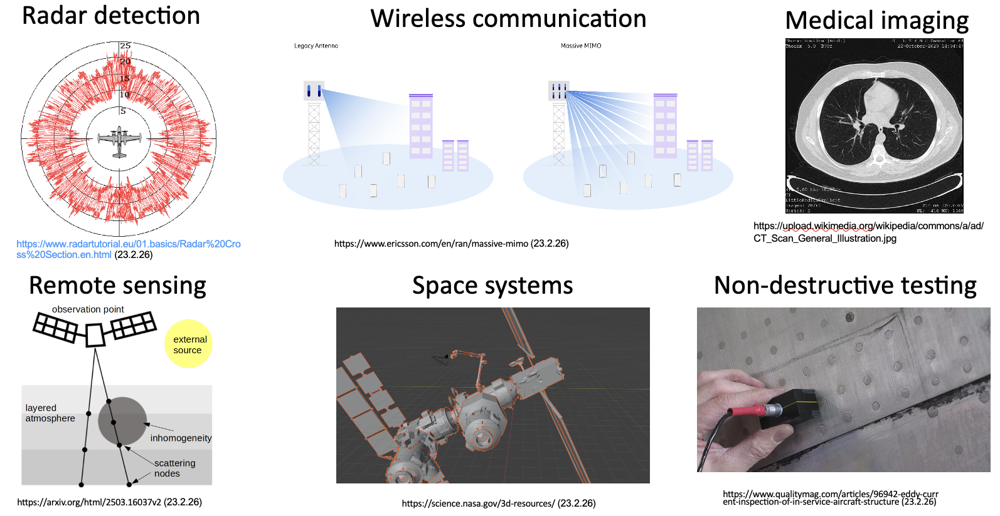
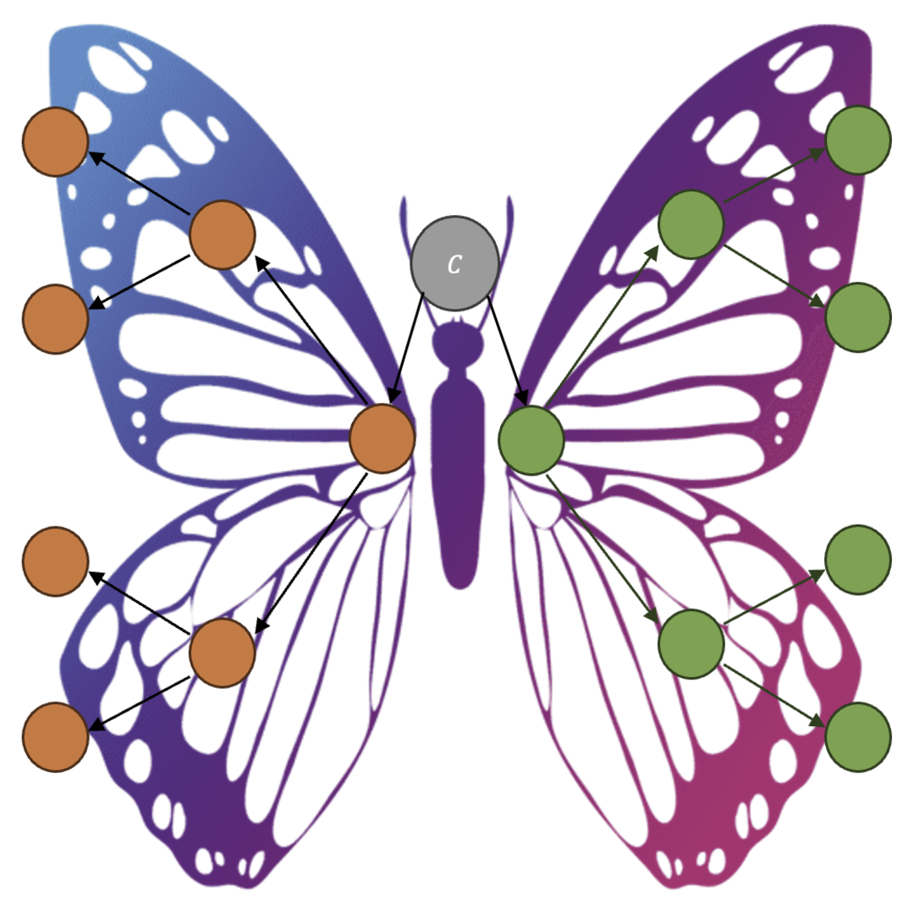
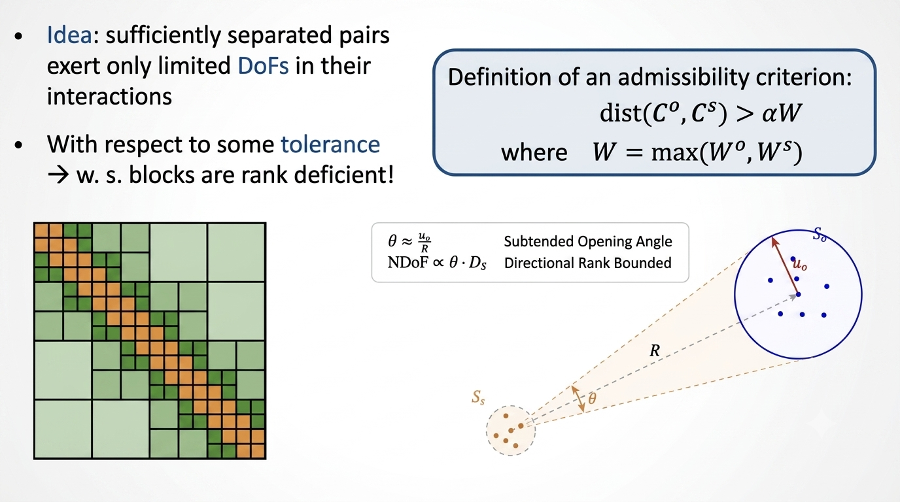
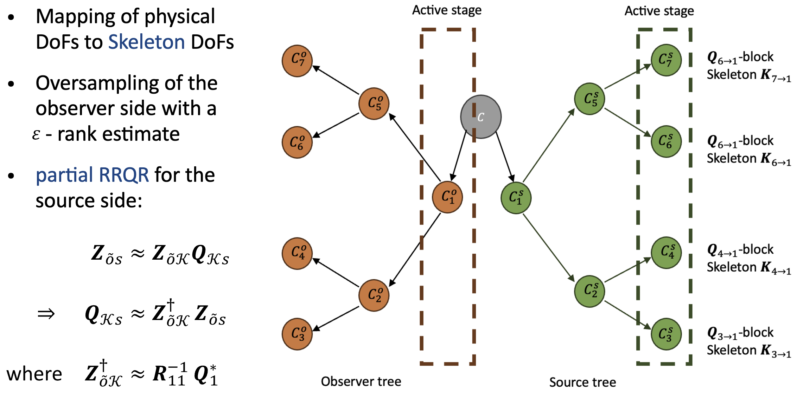
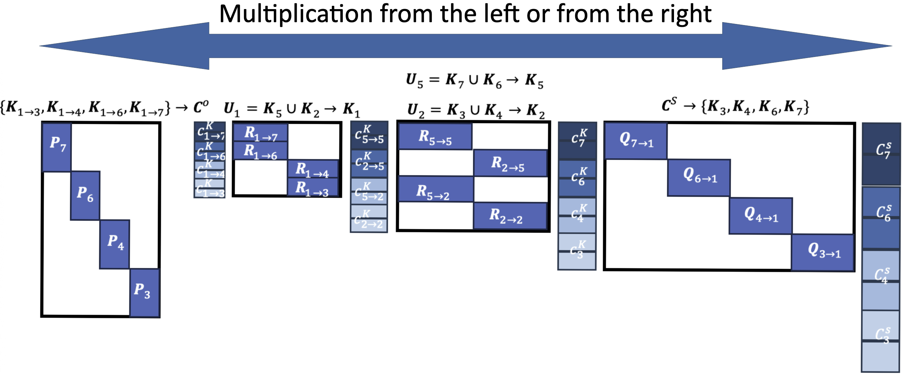
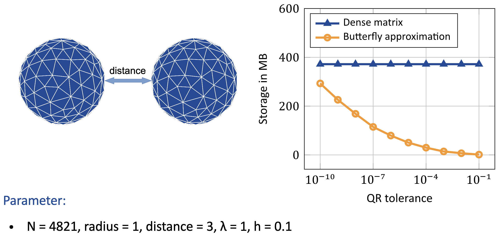
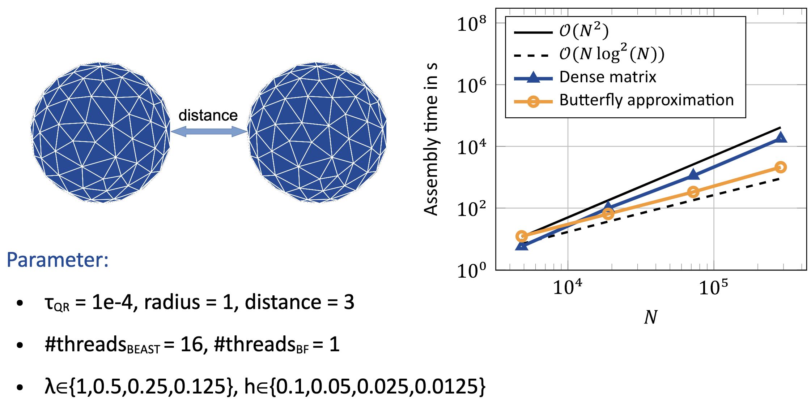
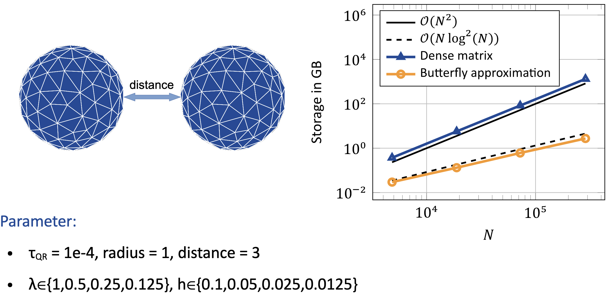

# ButterflyFactorizations

<p align="center">
  
</p>
 
<p align="center">
  <b>High-frequency matrix compression for electromagnetic integral equations using Butterfly Factorization</b>
</p>
 
<p align="center">
  Research software for scalable compression of far-field interactions in Method of Moments (MoM) discretizations.
</p>
 
<p align="center">
  <a href="https://Behn98.github.io/ButterflyFactorizations.jl/stable/"></a>
  <a href="https://Behn98.github.io/ButterflyFactorizations.jl/dev/"></a>
  <a href="https://github.com/Behn98/ButterflyFactorizations.jl/actions/workflows/CI.yml?query=branch%3Amain"></a>
</p>

---
 
## Overview
 
ButterflyFactorizations.jl is a research-oriented implementation of a Butterfly Factorization framework for high-frequency electromagnetic applications.
 
The project focuses on compressing far-field interactions arising in the discretization of integral equations, particularly in the context of Method of Moments (MoM) formulations of electromagnetic scattering problems.
 
In high-frequency regimes, conventional low-rank compression methods become increasingly inefficient. Butterfly factorization exploits the hierarchical structure of interactions between spatially separated domains to significantly reduce computational cost and storage requirements.

## At a Glance

**What this repository demonstrates**

- Scientific computing
- Hierarchical matrix compression
- Electromagnetic simulation
- High-performance numerical methods
- Julia package development
- Research software engineering

**Core techniques**

- Butterfly factorization
- Hierarchical trees
- Skeleton DoFs
- RRQR compression
- Method of Moments (MoM)
- EFIE discretization

### Main Goals
 
- Efficient compression of far-field interactions
- Reduced memory consumption for large scattering problems
- Faster matrix-vector products for iterative solvers
- Foundation for future butterfly algebra and direct solvers
- Scalable implementation for electrically large problems
 
---
 
## Why Butterfly Factorization?

Large-scale electromagnetic simulations appear in numerous scientific and engineering domains:

- Radar cross-section analysis
- Wireless communication and massive MIMO systems
- Medical imaging and ultrasound tomography
- Remote sensing
- Space systems and scattering analysis
- Non-destructive testing
 
<p align="center">
  
</p>

When solving electromagnetic scattering problems using the Electric Field Integral Equation (EFIE) and Method of Moments (MoM), the resulting dense matrices become computationally expensive.

In low-frequency settings, matrix blocks are often compressed using low-rank approximations such as:

- Singular Value Decomposition (SVD)
- Adaptive Cross Approximation (ACA)

However, in the high-frequency regime, singular values deteriorate but do not vanish sufficiently fast, making classical low-rank approximations increasingly inefficient.

Butterfly factorization addresses this challenge by exploiting the structured interactions between sufficiently separated source and observer domains.

---

## Mathematical Background

The implementation targets matrices arising from high-frequency discretizations of electromagnetic integral equations.

Using the Method of Moments (MoM), the boundary integral formulation is discretized using basis functions (e.g., RWG basis functions), resulting in dense interaction matrices.

Far-field interactions exhibit hierarchical structure and can be compressed efficiently using butterfly decompositions.

### Complexity Improvements

The butterfly approach reduces:

- Computational complexity
- Storage complexity
- Cost of matrix-vector products

for large-scale scattering problems.

> Exact asymptotic scaling and benchmark numbers will be updated as the implementation matures.

---

## Algorithm Overview

At a high level, the butterfly factorization proceeds through a hierarchical decomposition of source and observer domains.

### 1. Hierarchical Domain Decomposition

Source and observer domains are recursively subdivided into trees.

<p align="center">
  
</p>
   
<p align="center">
  <i>Hierarchical observer and source tree decomposition.</i>
</p>

This hierarchical structure enables the identification of admissible interactions between sufficiently separated clusters.

---

### 2. Admissibility Criterion

Interactions between sufficiently separated source-observer pairs exhibit reduced effective dimensionality.

<p align="center">
  
</p>

These admissible blocks become suitable for butterfly compression.

---

### 3. Skeleton Degree of Freedom Compression

Physical degrees of freedom are mapped onto skeleton degrees of freedom, allowing compressed interaction representations.

Compression is performed using:

- Oversampling-based rank estimation
- Partial RRQR factorization
- Hierarchical propagation of skeleton information

<p align="center">
  
</p>

As the hierarchy progresses:

- Source clusters grow larger
- Observer clusters become smaller
- Effective interaction rank remains approximately constant

This property is central to the efficiency of butterfly factorization.

---

### 4. Matrix-Vector Product Application

The compressed butterfly representation is applied efficiently within matrix-vector products.

<p align="center">
  
</p>

This forms the basis for efficient iterative solvers.

---

## Numerical Results

The implementation has been tested on benchmark scattering scenarios.

### Example Configuration

Parameters:
```txt
N = number of unknowns,
radius,
distance,
λ = wavelength,
h = discretization stepsize,

```

### Compression Accuracy

<p align="center">
  
</p>
     
### Runtime and Scaling
     
<p align="center">
  
</p>

### Memory Efficiency
      
<p align="center">
  
</p>

Additional benchmarks and performance evaluations will be added as development progresses.
        
---
        
## Current Status
        
### Implemented
        
✅ Compression of far-field interactions  
✅ Inclusion of near- and far-field interactions with controllable error  
✅ Hierarchical tree decomposition  
✅ Matrix-vector product support  
✅ Numerical validation framework  

### Work in Progress

The current development roadmap focuses on:

1. **Parallelization**
   - Multi-threaded butterfly construction
   - Improved scaling for large systems

2. **Butterfly Algebra**
   - Matrix construction from butterfly factors
   - Towards direct solver support

3. **Performance Engineering**
   - Profiling bottlenecks
   - Memory optimization
   - Improved benchmark coverage
        
---

## Installation

```julia
using Pkg
Pkg.add(url="https://github.com/Behn98/ButterflyFactorizations.jl")
```
        
Or clone locally:
        
```bash
git clone https://github.com/Behn98/ButterflyFactorizations.jl
cd ButterflyFactorizations.jl
```
        
---
        
## Example Usage
        
```julia
using BEAST
using CompScienceMeshes
using H2Trees
using ButterflyFactorizations
using LinearAlgebra

h = 0.05
lambda = 1
k = 2 * pi / lmabda
m = meshsphere(1.0, h)
X = raviartthomas(m)
op = Maxwell3D.singlelayer(; wavenumber=k)
blktree = TwoNTree(X, X, lambda / 10)

@time Bfmat = ButterflyFactorizations.PetrovGalerkinBF(
    op,
    X,
    X,
    blktree,
    k;
    Compressor=ButterflyFactorizations.PartialQR(),
    tol=1e-3,
    α=2,
)
A = assemble(op, X, X)
xtest = rand(ComplexF64, size(Bfmat, 2))
xs1 = Bfmat * xtest
xs = A * xtest
diff2 = norm(xs - xs1) / norm(xs)
```
        
> Examples will be expanded with reproducible benchmark scripts.
        
## References (selection)
        
This project builds upon ideas introduced in:
        
- Michielssen & Boag https://ieeexplore.ieee.org/document/511816, https://onlinelibrary.wiley.com/doi/abs/10.1002/mop.4650071707 (1994, 1996)
- Kaplan & Brick https://ieeexplore.ieee.org/document/9732959 (2022)
- Li et al. https://arxiv.org/abs/1502.01379 (2015)
- Guo et al. https://ieeexplore.ieee.org/document/7982657 (2017)
- Heldring, Ubeda & Rius https://ieeexplore.ieee.org/abstract/document/11231064 (2026)
        
---
        
## Acknowledgements

This project originated from research work on high-frequency matrix compression for electromagnetic scattering problems.
        
Special thanks to the scientific literature and open research community that enabled this implementation.

---
        
## License
        
Choose a license before publishing:
- MIT