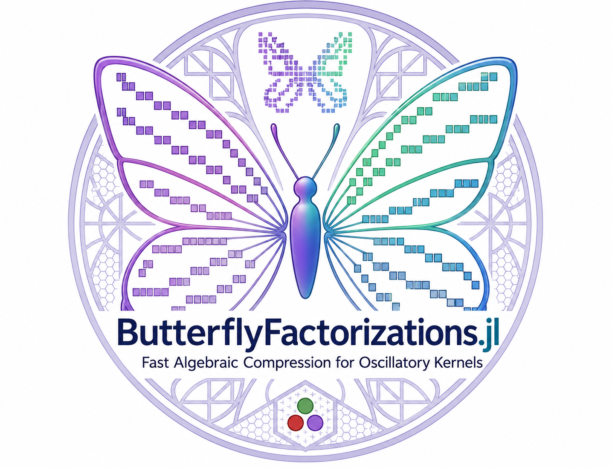

# ButterflyFactorizations.jl

<p align="center">
  
</p>

<p align="center">
  <b>High-frequency matrix compression for electromagnetic integral equations using Butterfly Factorization</b>
</p>

<p align="center">
  <a href="https://Behn98.github.io/ButterflyFactorizations.jl/stable/"></a>
  <a href="https://Behn98.github.io/ButterflyFactorizations.jl/dev/"></a>
  <a href="https://github.com/Behn98/ButterflyFactorizations.jl/actions/workflows/CI.yml?query=branch%3Amain"></a>
</p>

---

## Introduction

`ButterflyFactorizations.jl` is a high-performance Julia package providing a Butterfly Factorization framework for high-frequency electromagnetic applications. 

By exploiting the complementary low-rank property of far-field interactions across hierarchical domain trees, this package reduces the storage and matrix-vector multiplication complexity of dense oscillatory kernel matrices from $\mathcal{O}(N^2)$ to $\mathcal{O}(N \log N)$. It integrates natively with `H2Trees.jl` for hierarchical clustering and supports flat-array, thread-safe workspaces for zero-allocation matrix-vector products.

For a deep dive into the mathematical background, algorithmic structure, and performance benchmarks, please see the [official documentation](https://Behn98.github.io/ButterflyFactorizations.jl/stable/).

## Installation

Installing `ButterflyFactorizations.jl` is done by entering the package manager (enter `]` at the Julia REPL) and issuing:

```julia
pkg> add [https://github.com/Behn98/ButterflyFactorizations.jl.git](https://github.com/Behn98/ButterflyFactorizations.jl.git)
        
Or clone locally:
        
```bash
git clone https://github.com/Behn98/ButterflyFactorizations.jl
cd ButterflyFactorizations.jl
```
        
---
        
## Example Usage
        
```julia
using BEAST
using CompScienceMeshes
using H2Trees
using ButterflyFactorizations
using LinearAlgebra
using OhMyThreads
using BenchmarkTools

# Restrict BLAS threads for efficient custom parallelization
LinearAlgebra.BLAS.set_num_threads(1)

# Problem Setup
h = 0.05
lambda = 10 * h
k = 2 * pi / lambda
m = meshsphere(1.0, h)
X = raviartthomas(m)
op = Maxwell3D.singlelayer(; wavenumber=k)

# Tree Decomposition
tree = ButterflyFactorizations.build_bisection_tree(X.pos; max_points=100)
blktree = BlockTree(tree, tree)

# Assemble Butterfly Factorization
@time Bfmat = ButterflyFactorizations.PetrovGalerkinBF(
    op, X, X, blktree, k;
    compressor=ButterflyFactorizations.PartialQR(),
    tol=1e-3,
    scheduler=OhMyThreads.DynamicScheduler(),
)

# Matrix-Vector Multiplication Validation
@time A = assemble(op, X, X) # dense assembly by BEAST!
xtest = rand(ComplexF64, size(Bfmat, 2))
xs1 = Bfmat * xtest
xs = A * xtest

@belapsed Bfmat * xtest
@belapsed A * xtest

diff2 = norm(xs - xs1) / norm(xs)
println("Relative Error: ", diff2)

```
  
        
## References (selection)
        
This project builds upon ideas introduced in:
        
- Michielssen & Boag https://ieeexplore.ieee.org/document/511816, https://onlinelibrary.wiley.com/doi/abs/10.1002/mop.4650071707 (1994, 1996)
- Kaplan & Brick https://ieeexplore.ieee.org/document/9732959 (2022)
- Li et al. https://arxiv.org/abs/1502.01379 (2015)
- Guo et al. https://ieeexplore.ieee.org/document/7982657 (2017)
- Heldring, Ubeda & Rius https://ieeexplore.ieee.org/abstract/document/11231064 (2026)
        
---
        
## Acknowledgements

This project originated from research work on high-frequency matrix compression for electromagnetic scattering problems.
        
Special thanks to the scientific literature and open research community that enabled this implementation.

---
        
## License
        
- MIT