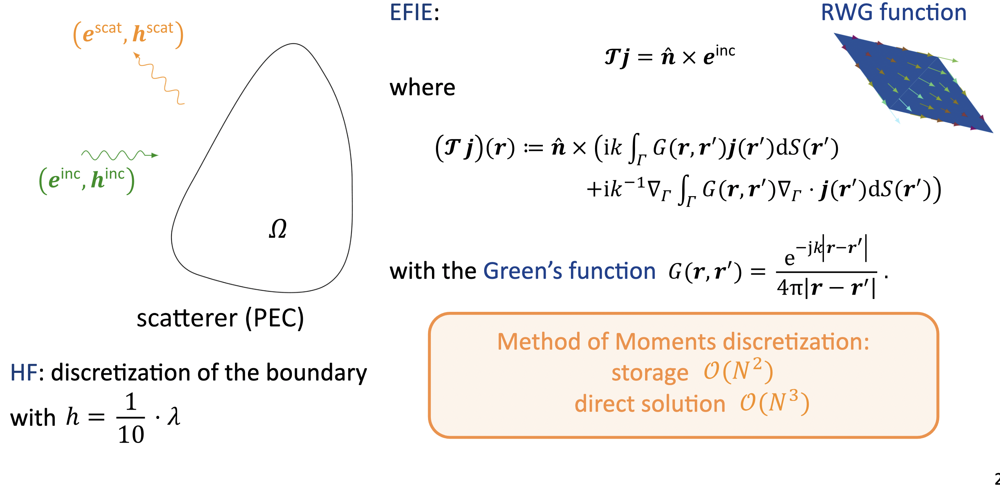
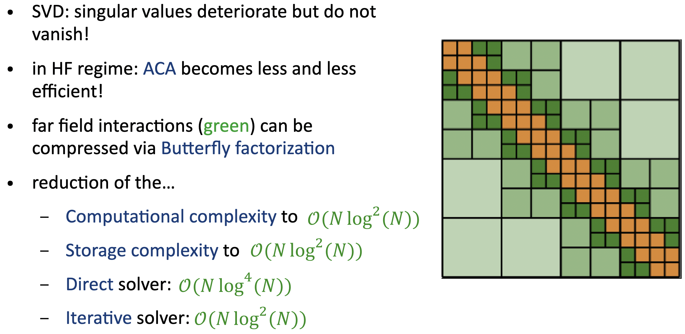
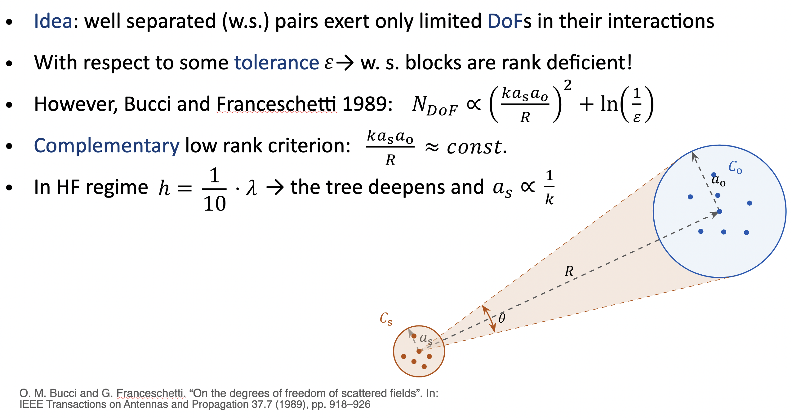
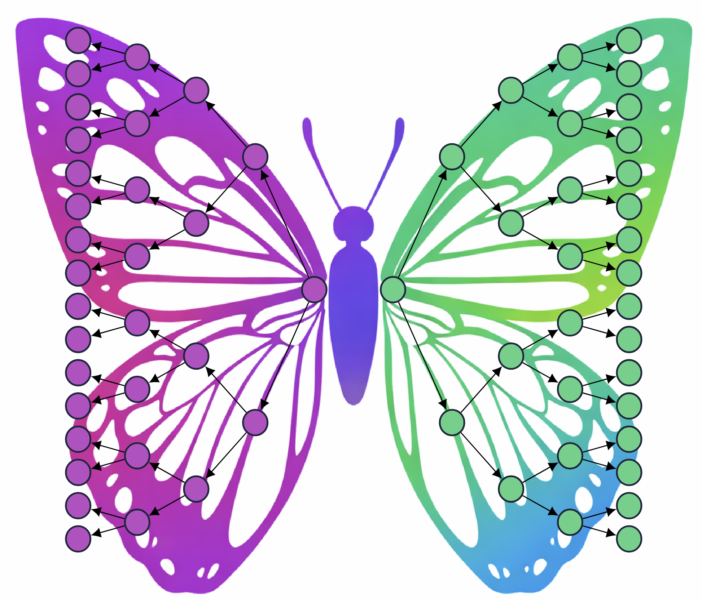
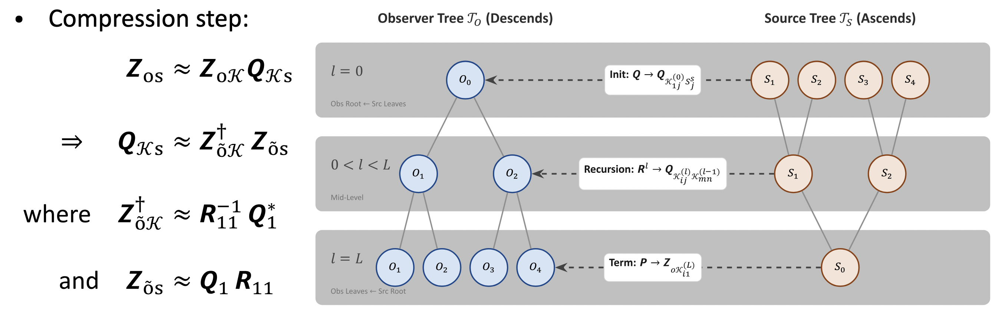
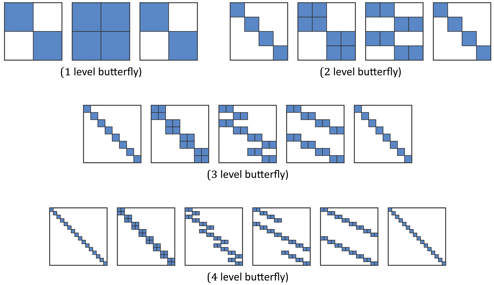

# Mathematical Theory

## 1. EFIE and Method of Moments Discretization

The Electric Field Integral Equation (EFIE) on a perfectly conducting (PEC) scatterer is formulated as $\mathcal{T}j = \hat{n} \times e^{inc}$, where the operator incorporates the free-space Green's function $G(r,r') = \frac{e^{-ik|r-r'|}}{4\pi|r-r'|}$. Discretizing this boundary using Rao-Wilton-Glisson (RWG) basis functions via the Method of Moments (MoM) generates a dense interaction matrix.

For electrically large problems, this dense formulation becomes an immediate bottleneck, requiring $\mathcal{O}(N^2)$ complexity for both storage and matrix-vector products, and $\mathcal{O}(N^3)$ complexity for direct solutions.

---

## 2. The High-Frequency Challenge

In computational electromagnetics, off-diagonal matrix blocks representing far-field interactions are generally rank-deficient, but in the high-frequency (HF) regime, classical low-rank approximations such as Singular Value Decomposition (SVD) and Adaptive Cross Approximation (ACA) become increasingly inefficient. 

The singular values deteriorate but do not vanish. Because the necessary degrees of freedom scale proportionally to $(k a_s a_o / R)^2$, standard compression techniques fail to maintain efficiency as the mesh scales.

---

## 3. The Complementary Low-Rank Property

Butterfly Factorization overcomes this high-frequency barrier by leveraging the complementary low-rank criterion. 

The core mathematical insight is that the interaction rank remains bounded if the product of the source and observer cluster sizes is strictly controlled relative to their distance. By enforcing the condition $\frac{k a_s a_o}{R} \approx \text{const}$, the effective rank remains $\mathcal{O}(1)$ even as the tree deepens and the source size $a_s$ scales proportionally to $\frac{1}{k}$.

---

## 4. Hierarchical Tree Traversal

To exploit this property, the factorization initially computes a low-rank representation of the interactions between a highly localized (small) source cluster and a broad (large) observer cluster. The algorithm then dynamically scales the geometric cluster sizes by simultaneously traversing *up* the source tree (expanding the source domain) and *down* the observer tree (shrinking the observer domain). 

This symmetrical, inverse traversal across the hierarchical trees visually and structurally resembles a butterfly.

The exact compression step maps the physical degrees of freedom to skeleton degrees of freedom ($\mathcal{K}$), governed by the relations $Z_{os} \approx Z_{o\mathcal{K}} Q_{\mathcal{K}s}$ and $Q_{\mathcal{K}s} \approx Z_{\tilde{o}\mathcal{K}}^\dagger Z_{\tilde{o}s}$.

---

## 5. Factorization Patterns

As the algorithm cascades through the tree levels, the original dense far-field interaction block is factored into a sequence of block-sparse matrices. Depending on the depth of the hierarchical tree (e.g., 1-level, 2-level, up to 4-level and beyond), the resulting factorization matrices exhibit distinct sparsity patterns.

